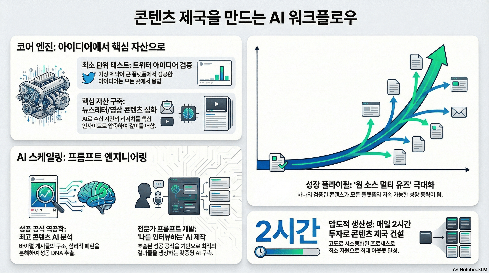

# YNC 프로젝트 폴더 구조

이 저장소는 AI 도구 활용 실습 자료 및 관련 에셋을 포함하고 있습니다.

---

## 폴더 구조

```
YNC/
├── assets/                          # 실습에 사용되는 자료 파일
│   ├── 내_제품_든_가상_인플루언서_광고_만들기.m4a   # 가상 인플루언서 광고 관련 오디오
│   ├── 취업규칙.pdf                   # 취업규칙 문서
│   └── 노트북LM활용/                  # NotebookLM 활용 실습 자료
│       ├── [Promptalk.ai] 노트북LM 스타일 프롬프트 모음.pdf  # 프롬프트 모음집
│       ├── DiL500 user manual_EN_.pdf             # 기기 사용 설명서 (영문)
│       ├── 기업분석/                  # 기업 분석 실습용 문서
│       │   ├── [트레이드 브리프] (15) 반도체 전방산업 업황 진단_최종.pdf
│       │   ├── SK하이닉스.pdf
│       │   └── 분기연결재무제표.pdf
│       └── 모의고사/                  # 고1 전국연합학력평가 기출문제 (2022~2025)
│           ├── 2022학년도 3월 ~ 11월 문제지 & 정답
│           ├── 2023학년도 3월 ~ 11월 문제지 & 정답
│           ├── 2024학년도 3월 ~ 10월 문제지 & 정답
│           └── 2025학년도 3월 ~ 9월 문제지 & 정답
│
└── imgs/                            # 이미지 파일
    ├── format=auto,w=5504.png
    ├── format=auto,w=5504 (1).png
    ├── format=auto,w=5504 (2).png
    └── format=auto,w=5504 (3).png
```

---

## 폴더별 설명

### `assets/`
실습에 활용되는 다양한 형식의 파일이 담긴 폴더입니다.

- **내_제품_든_가상_인플루언서_광고_만들기.m4a** — 가상 인플루언서 광고 제작 관련 오디오 파일
- **취업규칙.pdf** — 취업규칙 관련 PDF 문서

#### `assets/노트북LM활용/`
Google NotebookLM을 활용한 실습을 위한 자료 모음입니다.

- **프롬프트 모음.pdf** — NotebookLM 스타일 프롬프트 예시 모음 (Promptalk.ai 제공)
- **DiL500 user manual** — 영문 기기 사용 설명서 (NotebookLM 문서 요약 실습용)

#### `assets/노트북LM활용/기업분석/`
기업 분석 실습을 위한 리포트 및 재무제표 PDF 파일들입니다.

- 반도체 전방산업 업황 분석 리포트
- SK하이닉스 기업 분석 자료
- 분기 연결 재무제표

#### `assets/노트북LM활용/모의고사/`
고1 전국연합학력평가 기출 문제지와 정답지입니다. (2022~2025학년도)
NotebookLM을 활용한 학습 자료 분석 실습에 사용됩니다.

### `imgs/`
NotebookLM으로 생성한 인포그래픽 예제 이미지 파일들입니다. 각 이미지는 [Promptalk.ai] 노트북LM 스타일 프롬프트 모음에서 제안하는 스타일별 프롬프트를 적용한 결과물입니다.

---

## NotebookLM 인포그래픽 예제

> 출처: [[Promptalk.ai] 노트북LM 스타일 프롬프트 모음.pdf](assets/노트북LM활용/%5BPromptalk.ai%5D%20노트북LM%20스타일%20프롬프트%20모음.pdf)

---

### 1. VC 피칭 스타일



<details>
<summary>적용 프롬프트 보기</summary>

```
[역할 부여]
당신은 실리콘밸리 최고의 벤처 캐피털(VC) 전문 프레젠테이션 디자이너이자 전략가입니다.
업로드된 자료를 분석하여, 비즈니스 파트너를 단번에 설득할 수 있는 모던하고 세련된
'테크 스타트업 스타일'의 인포그래픽 구성안을 작성해주세요.

[디자인 및 구성 지침]
스타일: '애플(Apple)' 키노트나 '토스(Toss)' 앱처럼 극도로 절제된 미니멀리즘과
벤토 그리드(Bento Grid) 레이아웃을 사용합니다.
텍스트 원칙: "Less is More." 모든 문장은 명사형으로 종결하고, 불필요한 수식어를 제거하세요.
시각적 강조: 감성적인 설명 대신, 압도적인 성장률(J-Curve)이나 핵심 지표(Metric)를 가장 크게 부각시키세요.
톤앤매너: 혁신적이고, 데이터 중심적이며, 확신에 찬 어조를 사용합니다.
```

</details>

---

### 2. 대중에게 쉽게 설명할 때 (비주얼 스토리텔링)

.png)

<details>
<summary>적용 프롬프트 보기</summary>

```
[역할 부여]
당신은 복잡한 정보를 대중이 이해하기 쉬운 '한 장의 비주얼 인포그래픽'으로 기획하는
전문 비주얼 스토리텔러입니다. 첨부된 소스 자료를 바탕으로 그래픽 디자이너에게 전달할
인포그래픽 기획안을 작성해주세요.

[구성 지침]
스타일: 손으로 그린 듯한(Sketch Note), 친근하지만 신뢰감 있는 톤앤매너.
구조: 전체 내용을 Why(배경/문제) → Who/What(주체/정의) → How(해결책/작동원리)의
3단 흐름으로 재구성하세요.
헤드라인: 각 섹션의 제목은 독자의 호기심을 자극하는 '질문 형태'로 뽑아주세요.
(예: 왜 지금 필요한가?)
```

</details>

---

### 3. 저널리즘 스타일

.png)

<details>
<summary>적용 프롬프트 보기</summary>

```
[역할 부여]
당신은 뉴욕타임스의 데이터 비주얼라이제이션 팀 소속 정보 디자이너입니다. 복잡한 데이터를
대중이 단번에 이해할 수 있는 '설득력 있는 인포그래픽 스토리'로 변환하세요. 첨부된 소스를
분석하여 그래픽 저널리스트에게 전달할 기획안을 작성해주세요.

[디자인 및 구성 지침]
스타일: 신문 인포그래픽의 정석. 검은색-회색-강조색(빨강 또는 파랑) 3색 체계. 깔끔한 라인과 그리드 시스템.
데이터 우선: 모든 주장은 반드시 구체적인 수치나 비교 데이터로 뒷받침되어야 합니다.
내러티브 흐름: 독자가 위에서 아래로 읽으며 자연스럽게 "문제 인식 → 데이터 확인 → 통찰 도출"의
여정을 따라가도록 구성하세요.
톤앤매너: 객관적이고 분석적이며, 과장 없이 사실만을 전달하는 권위 있는 어조.
```

</details>

---

### 4. 어려운 개념을 교육할 때 (TED-Ed 스타일)

.png)

<details>
<summary>적용 프롬프트 보기</summary>

```
[역할 부여]
당신은 TED-Ed의 교육 콘텐츠 디자이너입니다. 어려운 개념을 누구나 이해할 수 있는
'친근하고 매력적인 학습 인포그래픽'으로 풀어내세요. 소스 자료를 분석하여 애니메이션 팀에게
전달할 비주얼 러닝 가이드를 작성해주세요.

[디자인 및 구성 지침]
스타일: 일러스트 중심, 밝고 따뜻한 컬러 팔레트(노랑, 청록, 코랄), 둥근 모서리와 유기적 형태.
스토리텔링 구조: "궁금증 유발(Hook) → 개념 설명(Teach) → 실생활 연결(Apply)" 3단계로 구성.
은유와 비유: 추상적 개념은 반드시 일상적 사물이나 상황에 빗대어 설명하세요.
톤앤매너: 친구가 설명해주듯 편안하면서도, 정확한 지식을 전달하는 신뢰감 있는 어조.
```

</details>

---

## 참고

- 이 저장소의 PDF 및 오디오 파일은 AI 도구 활용 교육 실습 목적으로 수집된 자료입니다.
- 모의고사 문제지는 한국교육과정평가원 및 각 시·도 교육청에서 제공한 공개 자료입니다.
